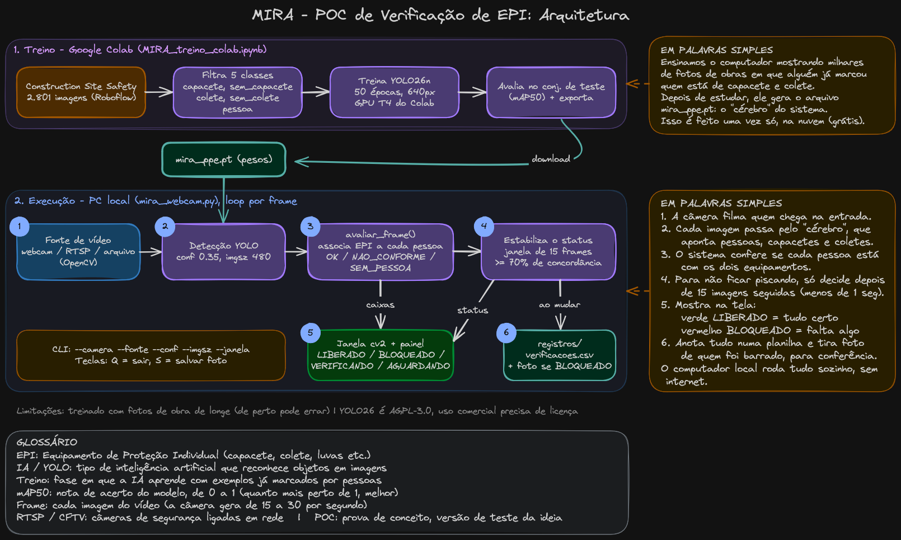

# MIRA | POC de verificação de EPI

Detecta **capacete** e **colete** pela webcam e mostra LIBERADO ou BLOQUEADO.

## Arquitetura



Fonte editável: [`docs/arquitetura.excalidraw`](docs/arquitetura.excalidraw) (abrir em [excalidraw.com](https://excalidraw.com)).

## Rodar

```
python -m venv venv
source venv/Scripts/activate
pip install -r requirements.txt
python mira_webcam.py
```

Das próximas vezes, só as duas últimas linhas sem o `pip`. Pra sair: `Q` na janela do vídeo. `S` salva uma foto.

## Opções

```
python mira_webcam.py --camera 1          # outra webcam
python mira_webcam.py --conf 0.5          # menos falso alarme
python mira_webcam.py --fonte rtsp://...  # câmera CFTV ou vídeo
```

## Registros

`registros/verificacoes.csv` guarda cada verificação e `registros/fotos/` a foto de cada não conformidade.

## Retreinar o modelo

Abrir `MIRA_treino_colab.ipynb` no Google Colab, usar GPU T4 e executar tudo. Gera um novo `mira_ppe.pt`.

## Limitações

- Treinado com fotos de obra tiradas de longe. De perto pode errar mais
- YOLO26 é AGPL-3.0: ok pra POC, produto comercial precisa de licença
- Dataset: Construction Site Safety (Roboflow), CC BY 4.0
